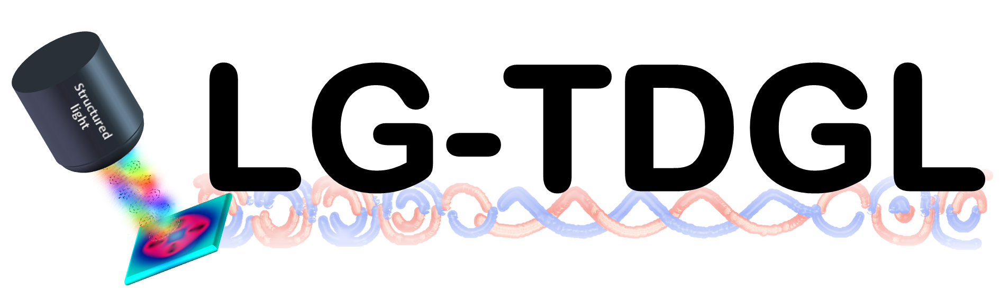

# LG-TDGL



Time-dependent Ginzburg-Landau in Python


[](https://py-tdgl.readthedocs.io/en/latest/?badge=latest)
[](https://codecov.io/gh/loganbvh/py-tdgl)

[](https://github.com/psf/black)
[](https://zenodo.org/badge/latestdoi/535746543)
### Check with Avinaash for meaning of icons


## Motivation

`LG-TDGL` provides the platform to solve the light-matter interaction between structured light and supercinducting order parameters. The solving order parameters is based on the framework of "generalized time-depdendent Ginzburg-Landau (TDGL) equation" in `pyTDGL`*. <br>
The work "Structured light induced vorticity in superconductors I: Linearly polarized light"** is based on the calculation of `LG-TDGL`. <br>
In this notebook, we provide an example of linearly polarized light induced vortex and demonstrate the results for the light imprinted superflow***.

*Link of `pyTDGL`: https://py-tdgl.readthedocs.io/en/latest/ <br>
  This code has to be executed under the environment of `pyTDGL`.
**DOI:xxxxxxxxxxxxxxxxxxxxx. <br>
***This figure is corresponds to Fig. 5 in reference "xxxxxxxxxxxxxxx".

## Try `LG-TDGL`

Click the badge below to try `pyTDGL` interactively online via [Google Colab](https://colab.research.google.com/):

[](https://colab.research.google.com/github/TienTienYeh/lg-tdgl/blob/main/docs/quickstart.ipynb)


### Install via `pip`

From this [GitHub repository](https://github.com/TienTienYeh/lg-tdgl/):

```bash
pip install git+https://github.com/TienTienYeh/lg-tdgl.git
```

Editable installation:

```bash
git clone https://github.com/TienTienYeh/lg-tdgl.git
cd lg-tdgl
pip install -e ".[dev,docs]"
```
## About `pyTDGL`

### Authors

- Primary author and maintainer: [@TienTienYeh](https://github.com/TienTienYeh/).

### Citing `pyTDGL`

`LG-TDGL` is described in the following paper:

>* Structured light induced vorticity in superconductors I: Linearly polarized light (unpublished)

If you use `LG-TDGL` in your research, please cite the paper linked above.

    % BibTeX citation
    @article{
    unpublished
    }


### Acknowledgments

This work is based on the `pyTDGL` developed by Logan Bishop-Van Horn.
The documentation for `pyTDGL` can be found at [py-tdgl.readthedocs.io](https://py-tdgl.readthedocs.io/en/latest/).

(Install `pyTDGL`)

`pyTDGL` requires `python` `3.8`, `3.9`, `3.10`, or `3.11`. We recommend installing `pyTDGL` in a [`conda` environment](https://conda.io/projects/conda/en/latest/user-guide/tasks/manage-environments.html), e.g.

```bash
conda create --name tdgl python="3.10"
conda activate tdgl
```


